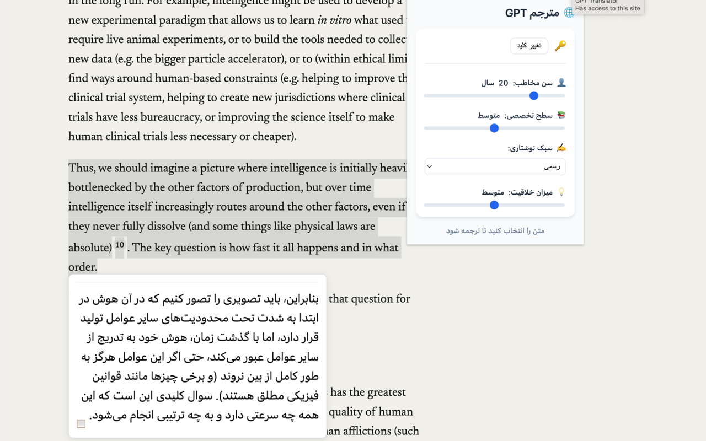

# 🌐 GPT Translator Chrome Extension

A powerful Chrome extension that translates English text to Persian using OpenAI's GPT API, with customizable translation settings for age group, expertise level, writing style, and creativity level.



## ✨ Features

- 🚀 Fast translation of selected text from English to Persian
- 👥 Adjustable target age (5-80 years)
- 📚 Customizable expertise level (from very simple to highly technical)
- ✍️ Multiple writing styles (formal, informal, colloquial)
- 💡 Adjustable creativity in translation
- 🎨 Modern and intuitive user interface
- 🔐 Secure API key storage
- 📋 One-click copy functionality
- ⚡ Real-time translation updates

## 🛠️ Installation

### From Chrome Web Store
*Coming Soon! The extension is currently under review by the Chrome Web Store team (estimated review time: 2-3 weeks).*

### Manual Installation (Recommended until Chrome Web Store approval)
1. Download this repository as ZIP or clone it:
```bash
git clone https://github.com/jozi/gpt-translate-ex.git
# OR
# Download ZIP from the green "Code" button above
```
2. Open Chrome and go to `chrome://extensions`
3. Enable "Developer mode" (toggle in top-right corner)
4. Click "Load unpacked"
5. Select the downloaded/cloned project folder

> **Note**: Due to Chrome's security restrictions, direct CRX installation is no longer supported. Please use the manual installation method above until the extension is available on the Chrome Web Store.

## 🔑 API Key Setup

1. Visit [OpenAI's API Keys page](https://platform.openai.com/account/api-keys)
2. Create or log in to your account
3. Generate a new API key
4. Click the extension icon in Chrome
5. Enter your API key
6. Click "Save"

## 🎯 How to Use

1. Select any English text on a webpage
2. The translation popup will appear automatically
3. Adjust translation settings as needed:
   - Target age
   - Expertise level
   - Writing style
   - Creativity level
4. Copy the translation with one click


## ⚙️ Technical Details

- **Platform**: Chrome Browser Extension
- **API**: OpenAI GPT
- **Storage**: Chrome Storage Sync API
- **Languages**: JavaScript, HTML, CSS
- **Manifest Version**: 3

## 🔒 Privacy & Security

- Only communicates with OpenAI's official API
- No data collection or third-party servers
- API key stored securely in Chrome sync storage
- No tracking or analytics
- Open source code for transparency

## 🚧 Development

1. Make your changes
2. Test locally:
```bash
# Load the extension in Chrome
chrome://extensions -> Load unpacked

# Make changes
# Reload the extension to see changes
```

## 🤝 Contributing

We welcome contributions! Please:

1. Fork the repository
2. Create your feature branch
3. Commit your changes
4. Push to the branch
5. Create a Pull Request

## 📝 License

MIT License - see [LICENSE](LICENSE) for details

## 📬 Contact

- GitHub Issues: [Create an issue](https://github.com/jozi/gpt-translate-ex/issues)
- Email: [hosein.jozi@gmail.com](mailto:hosein.jozi@gmail.com)

## 🙏 Acknowledgments

- OpenAI for providing the GPT API
- All contributors and users of this extension
